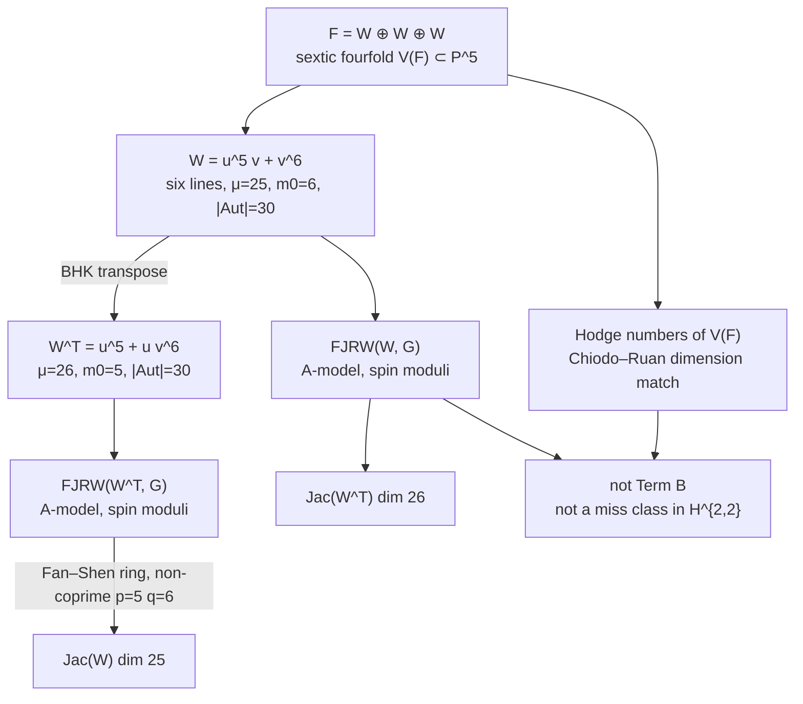

# Chain atom — peer-review figure

Author: Benjamin Stanley Frohman (@BenFrohman)
Copyright (c) 2026 Benjamin Stanley Frohman. Apache-2.0.

The arrow that is *not* drawn: a named γ in H^4(V(F), Q) ∩ H^{2,2} outside im(cl). That slot stays empty.
