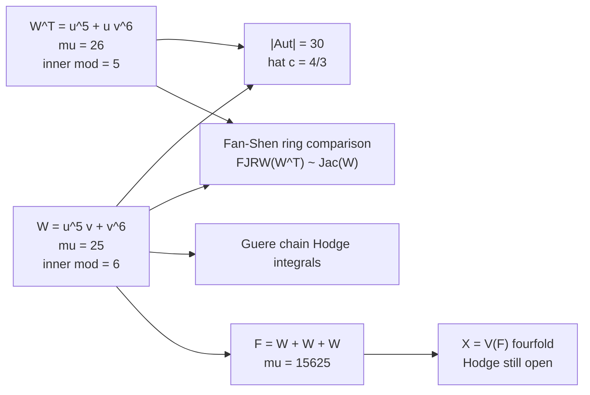

# Stepwise calculations that feed FJRW

Author: Benjamin Stanley Frohman (@BenFrohman)
Copyright (c) 2026 Benjamin Stanley Frohman. Apache-2.0.
Date: 25 September 2026

These are the ranks the enumerative theory consumes. They are not the correlators.

## 1. Exponent matrix and Aut

W = u^5 v + v^6 has matrix

    A = [[5, 1], [0, 6]],    det A = 30.

Diagonal characters: mu^6 = 1 and lambda^5 mu = 1. Thirty solutions. Same det for A^T. So |Aut(W)| = |Aut(W^T)| = 30. This is the largest admissible G.

## 2. Weights and mu(W)

W is weighted-homogeneous of degree 6 with weights (1,1):

    mu(W) = (6/1 - 1)(6/1 - 1) = 25.

Six lines through the origin: mu = (6-1)^2 = 25. Conversion 30 * 5/6 = 25.
Leading terms v^6, u^5, u^4 v. Monomials: {1,u,u^2,u^3} x {1,...,v^5} union {u^4} = 25.

## 3. Weights and mu(W^T)

W^T = u^5 + u v^6, weights (3,2), degree 15:

    mu(W^T) = (15/3 - 1)(15/2 - 1) = 4 * 13/2 = 26.

Identity: v^5 (5 u^4 + v^6) - 5 u^3 (u v^5) = v^11.
Leading terms u^4, u v^5, v^11. Monomials: {v^0..v^10} union {u,u^2,u^3} x {v^0..v^4} = 11+15 = 26.

## 4. Fan-Shen labels

    W   = X^5 Y + Y^6     (dual form)
    W^T = X^5 + X Y^6     (Fan-Shen input form)
    p = 5, q = 6, gcd(p-1, q) = gcd(4,6) = 2.

Coprime theorem does not apply off the shelf. Dimensions the rings must match, if the general two-variable statement holds:

    dim FJRW(W^T, G) = dim Jac(W)   = 25
    dim FJRW(W,   G) = dim Jac(W^T) = 26

## 5. What a correlator is

An FJRW correlator

    < tau_{k1}(alpha_1), ..., tau_{kn}(alpha_n) >_{g,n}^{W,G}

is an intersection number on the virtual class of the moduli space of W-spin orbicurves of genus g with n markings. Each alpha_i is a state in the FJRW state space (narrow or broad sector). Each tau_k is a psi-class power at that marking. The virtual class comes from the Witten equation

    dbar u_i + partial W / partial u_i = 0

on those orbicurves.

For this atom those numbers live on spin moduli. They are not classes in H^4(V(F), Q) cap H^{2,2}(V(F)). This lab has not tabulated them. Guere's formula is the machine that would.

## Diagram

Three copies of the atom make F. F defines the fourfold. FJRW of one atom does not produce a miss class on that fourfold.
